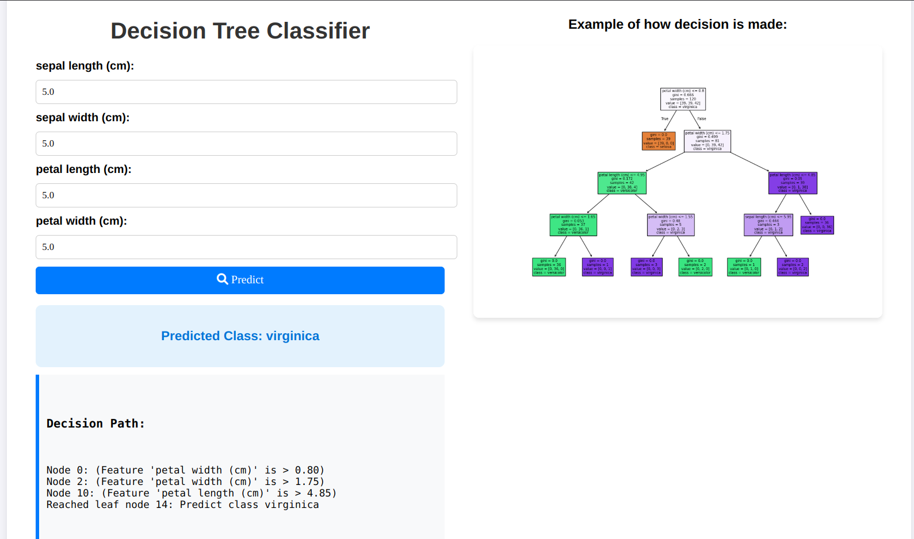

## Flower Classifier

This is a Django application. The core functionality of the application is a flower classifier built using scikit-learn. The model training code can be found in the `train.py` file.

The application is deployed on Render using Docker. The Dockerfile contains instructions to build an image from an online image that I published to dockerHub. It can be found at https://hub.docker.com/r/bisratberhanu/flower_classifier. The flower classifier accepts important features and determines the type of flower from four possible types.

deployed on : https://flower-classifier-tgog.onrender.com/

### Demo




### Commands to Run the Application

There are two ways to run the application
1. save the following code in a file called `docker-compose.yml` and run `docker compose up` in the terminal
```yml
version: "3.9"
services:
  app:
    container_name: django_app
    restart: always
    image: bisratberhanu/flower_classifier:django_app
    ports:
      - 8070:8000
    command: ["python3", "manage.py", "runserver", "0.0.0.0:8000"]

```

2. If building the image locally is preferred,this could be the case if minor changes are to be made to the code. In this case,follow the following steps:
     - Clone the repository
    - change the docker-compose  with the following code:

```yml
version: "3.9"
services:
  app:
    container_name: django_app
    restart: always
    build: .  #this builds locally
    ports:
      - 8070:8000
    command: ["python3", "manage.py", "runserver", "0.0.0.0:8000"]

```
- Run `docker compose up --build ` in the terminal

### Important Files
- `train.py` contains the code to train the model.

-  `decision_tree_classifier.pkl` is the trained model.

- `views.py`contains the API post and get methods.
- `templates/index.html` contains the html, css and Javascript code.

### Features
- The application has a home page where the user can input the features of the flower and get the prediction.
- the application also shows the path the decision classifier took to reach the conclusion.


